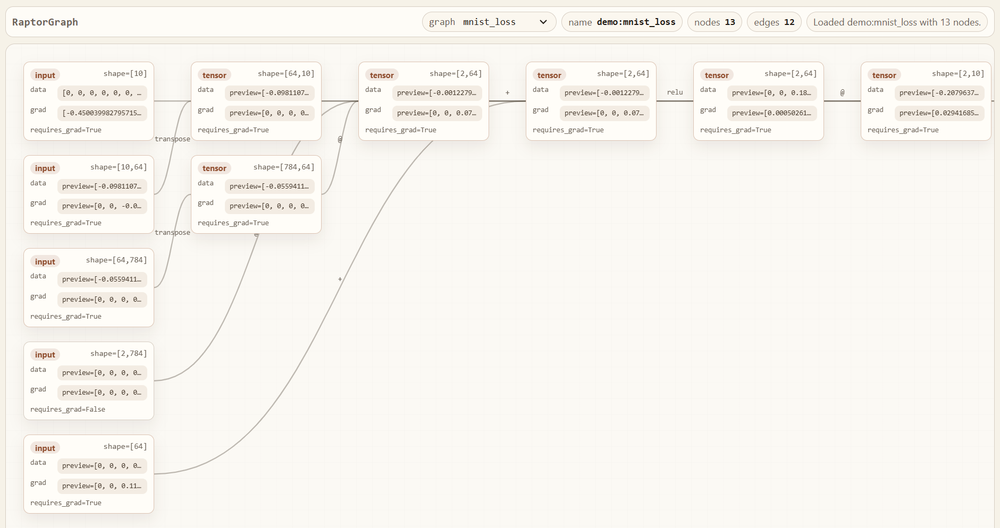

<p align="center">
  
</p>

# Raptor

Raptor is a from-scratch tensor autograd engine built in pure NumPy, paired with `raptorgraph`, a lightweight graph inspection tool for visualizing forward and backward computation graphs.

The project is intentionally small enough to read end to end and deep enough to surface the core engineering ideas behind modern deep learning systems:

- tensor-based reverse-mode autodiff
- broadcasting-aware gradient propagation
- neural network layer abstractions
- optimizers such as SGD and Adam
- MNIST training without relying on PyTorch for the core engine
- graph tracing and interactive inspection of tensor graphs

## Contents

- [Project Structure](#project-structure)
- [Design Goals](#design-goals)
- [Architecture](#architecture)
- [Core Components](#core-components)
- [Installation](#installation)
- [Quick Start](#quick-start)
- [Training on MNIST](#training-on-mnist)
- [Benchmarking Against PyTorch](#benchmarking-against-pytorch)
- [Using RaptorGraph](#using-raptorgraph)
- [Repository Layout](#repository-layout)
- [Current Scope](#current-scope)

## Project Structure

Raptor is split into two main parts:

- `raptor/`
  The core tensor engine, neural network abstractions, optimizers, and utility code.
- `raptorgraph/`
  A FastAPI-backed graph viewer that can render traced tensor graphs from built-in demos or graphs registered from user code.

This separation is deliberate:

- `raptor` computes
- `raptorgraph` observes

## Design Goals

The project is designed around a few concrete engineering goals.

1. Keep the core engine readable.
2. Implement tensor autograd directly rather than delegating to PyTorch.
3. Handle the non-trivial parts of tensor autodiff explicitly, especially:
   - broadcasting
   - reductions
   - matrix multiplication
   - graph traversal and gradient accumulation
4. Expose the runtime graph in a form that is inspectable in a browser.
5. Make the project useful as both a learning artifact and a practical systems exercise.

## Architecture

### 1. Tensor Engine

The center of the system is the `Tensor` type in [`raptor/engine.py`](raptor/engine.py).

Each tensor stores:

- `data`: the NumPy array payload
- `grad`: the accumulated gradient
- `_prev`: parent tensors that produced it
- `_op`: the operation label used for tracing/debugging
- `_backward`: a closure encoding the local backward rule

Backward propagation works by:

1. building a topological ordering of the graph from an output tensor
2. seeding the output gradient with ones
3. running each stored `_backward` closure in reverse topological order

### 2. Differentiable Operations

[`raptor/ops.py`](raptor/ops.py) contains reusable nonlinear operations such as:

- `relu`
- `sigmoid`
- `tanh`

Elementwise arithmetic, reductions, shape transforms, and matrix multiplication live on `Tensor` itself.

A key implementation detail is the broadcasting-aware gradient reduction helper used to map broadcasted gradients back to original input shapes.

### 3. Neural Network Layer API

[`raptor/nn.py`](raptor/nn.py) builds higher-level abstractions on top of the tensor engine:

- `Module`
- `Linear`
- `Sequential`
- activation wrappers
- `MSELoss`
- `CrossEntropyLoss`

The layer stack is intentionally minimal but sufficient for real training workloads such as MNIST classification.

### 4. Optimizers

[`raptor/optim.py`](raptor/optim.py) provides:

- `SGD`
- `Adam`

These operate directly on `Tensor.data` using gradients accumulated by the engine.

### 5. Data and Training Utilities

[`raptor/utils.py`](raptor/utils.py) includes:

- batch iteration
- classifier evaluation helpers
- MNIST download and IDX parsing
- history export utilities for JSON and CSV
- optional curve plotting helpers

### 6. Graph Inspection Layer

`raptorgraph` traces an output tensor into a browser-friendly graph representation.

[`raptorgraph/tracer.py`](raptorgraph/tracer.py) serializes a graph into:

- nodes
- edges
- compact summaries of tensor values and gradients

[`raptorgraph/server.py`](raptorgraph/server.py) serves:

- a static frontend
- demo graphs
- graph activation endpoints
- custom graph registration endpoints

[`raptorgraph/client.py`](raptorgraph/client.py) provides a simple notebook/script-side helper for sending traced graphs to the running server.

## Core Components

### `raptor/engine.py`

Responsibilities:

- dynamic graph construction
- reverse-mode autodiff
- gradient accumulation
- broadcasting-aware backward behavior
- reductions, reshape, transpose, matrix multiply

### `raptor/nn.py`

Responsibilities:

- parameter discovery
- forward composition
- trainable linear layers
- loss computation

### `raptor/optim.py`

Responsibilities:

- parameter update rules
- optimizer state such as momentum or Adam moments
- gradient clearing

### `raptorgraph/server.py`

Responsibilities:

- serve the frontend
- expose graph JSON over HTTP
- provide built-in demo graphs
- store custom named graphs registered from user code

## Installation

The project is managed as a Python package via `pyproject.toml`.

### Using `uv`

```bash
uv sync
```

### Using `pip`

```bash
pip install -e .
```

Project metadata currently declares Python `>=3.13` in [`pyproject.toml`](pyproject.toml).

## Quick Start

### Basic tensor usage

```python
import numpy as np
from raptor import Tensor

x = Tensor(np.array([1.0, 2.0, 3.0], dtype=np.float32), requires_grad=True)
y = (x * 2).sum()
y.backward()

print(x.grad)
```

### Small model forward and backward

```python
import numpy as np
from raptor import Tensor, nn

model = nn.Sequential(
    nn.Linear(4, 8),
    nn.ReLU(),
    nn.Linear(8, 3),
)

x = Tensor(np.random.randn(2, 4).astype(np.float32), requires_grad=False)
labels = np.array([0, 2], dtype=np.int64)

logits = model(x)
loss = nn.CrossEntropyLoss()(logits, labels)
loss.backward()
```

## Training on MNIST

Raptor includes a NumPy-based MNIST loader in [`raptor/utils.py`](raptor/utils.py).

Example:

```python
from raptor import Tensor, nn
from raptor.optim import Adam
from raptor.utils import load_mnist, batch_iterator, evaluate_classifier

X_train, y_train, X_test, y_test = load_mnist()

model = nn.Sequential(
    nn.Linear(784, 128),
    nn.ReLU(),
    nn.Linear(128, 64),
    nn.ReLU(),
    nn.Linear(64, 10),
)

criterion = nn.CrossEntropyLoss()
optimizer = Adam(model.parameters(), lr=1e-3)

for X_batch, y_batch in batch_iterator(X_train, y_train, batch_size=64, shuffle=True):
    x = Tensor(X_batch, requires_grad=False)
    logits = model(x)
    loss = criterion(logits, y_batch)

    optimizer.zero_grad()
    loss.backward()
    optimizer.step()
```

The current benchmark results in [`benchmarks/results/compare_results.json`](benchmarks/results/compare_results.json) show that the engine trains a competitive MNIST MLP and lands in essentially the same accuracy range as an equivalent PyTorch implementation.

## Benchmarking Against PyTorch

The benchmark script lives at [`benchmarks/compare.py`](benchmarks/compare.py).

It compares Raptor and PyTorch under controlled conditions:

- same architecture
- same initial weights
- same batch order per epoch
- same optimizer family and learning rate
- multiple seeds

Run it with:

```bash
python benchmarks/compare.py
```

Representative summary from the saved benchmark results:

- Raptor final test accuracy mean: `0.9767`
- PyTorch final test accuracy mean: `0.9764`
- Raptor average epoch time mean: `2.59s`
- PyTorch average epoch time mean: `2.06s`

The important result is not that one implementation “wins” a single run, but that the from-scratch engine converges to the same performance regime under controlled comparisons.

## Using RaptorGraph

Start the graph server:

```bash
uvicorn raptorgraph.server:app --reload
```

Open:

```text
http://127.0.0.1:8000
```

### Interface

<p align="center">
  
</p>

### Built-in graph demos

The viewer exposes several built-in graphs:

- `arithmetic`
- `mlp`
- `mnist_loss`

These are selectable from the minimal top-bar graph picker.

### Registering a custom graph from your own code

Use the helper in [`raptorgraph/client.py`](raptorgraph/client.py):

```python
import numpy as np
from raptor import Tensor, nn
from raptorgraph.client import register_graph

x = Tensor(np.array([[1.0, -2.0, 3.0, 0.5]], dtype=np.float32), requires_grad=False)

model = nn.Sequential(
    nn.Linear(4, 6),
    nn.ReLU(),
    nn.Linear(6, 3),
)

labels = np.array([2], dtype=np.int64)
logits = model(x)
loss = nn.CrossEntropyLoss()(logits, labels)
loss.backward()

register_graph(loss, name="quick_test_graph")
```

This sends the traced graph over HTTP to the running `raptorgraph` server, stores it there, and makes it selectable in the UI dropdown as `custom:quick_test_graph`.

This design avoids the earlier process-boundary issue where notebook memory and server memory were separate.

## Repository Layout

```text
raptor/
├── engine.py
├── nn.py
├── ops.py
├── optim.py
└── utils.py

raptorgraph/
├── client.py
├── server.py
├── tracer.py
└── static/
    ├── index.html
    ├── graph.js
    └── style.css

benchmarks/
├── compare.ipynb
├── compare.py
└── results/
    └── compare_results.json

data/
└── mnist/

notebooks/
├── graphlens.ipynb
├── mlp.ipynb
├── tensor_basics.ipynb
└── training.ipynb
```

## Current Scope

What is implemented now:

- tensor autograd with NumPy
- broadcasting-aware backward rules
- linear layers and activations
- MSE and cross-entropy losses
- SGD and Adam
- MNIST loading and training
- controlled benchmark comparison against PyTorch
- browser-based graph inspection with named custom graph registration

What is intentionally still lightweight:

- no GPU backend
- no convolutional layers
- no distributed training support
- no persistent graph database for `raptorgraph`
- no step-by-step backward playback yet

## License

No license file has been added yet.
